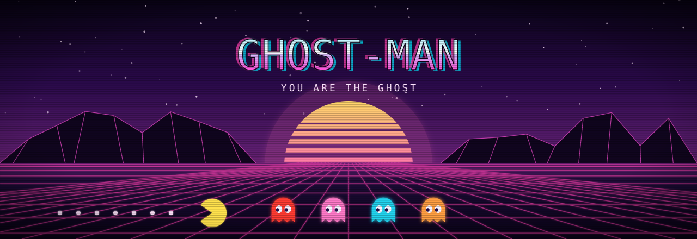
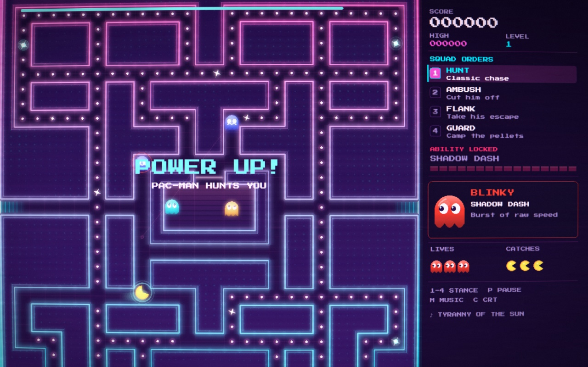
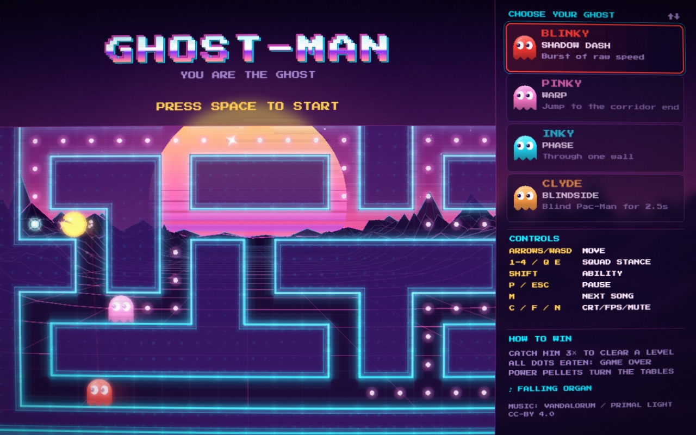

<p align="center">
  
</p>

<p align="center">
  <a href="https://www.vitormach.dev/ghost-man/"></a>
  <a href="https://github.com/vittau/ghost-man/releases/latest"></a>
  <a href="https://github.com/sponsors/vittau"></a>
</p>

<p align="center">
  An arcade game where the tables are turned: <b>you are the ghost</b>.<br>
  Lead a squad of four through a neon vaporwave maze and corner an AI Pac-Man
  that clears dots, grabs power pellets and, once he's powered up,
  <b>hunts you</b>.
</p>

<p align="center">
  
</p>

## 

**In the browser:** [vitormach.dev/ghost-man](https://www.vitormach.dev/ghost-man/).
Nothing to install; a keyboard or a controller both work.

**On your machine:** grab the latest build from
[Releases](https://github.com/vittau/ghost-man/releases/latest).

| System | File |
| --- | --- |
| Steam Deck / Linux | `Ghost-Man-…-linux-x64.tar.xz` |
| Windows | `Ghost-Man-…-windows-x64-setup.exe` (installer) or `…-portable.exe` |
| macOS (Apple Silicon) | `Ghost-Man-…-macos-arm64.dmg` |
| macOS (Intel) | `Ghost-Man-…-macos-x64.dmg` |

The desktop builds start in fullscreen with sound on. **F11** or
**Alt+Enter** toggles fullscreen, and **QUIT GAME** is on the pause screen.

> [!NOTE]
> The builds aren't signed with a paid certificate, so the OS asks once
> before the first launch.
>
> - **macOS** says it can't verify the app. Open **System Settings →
>   Privacy & Security**, scroll to the Ghost-Man notice and click **Open
>   Anyway**. From a terminal:
>   `xattr -dr com.apple.quarantine /Applications/Ghost-Man.app`
> - **Windows** SmartScreen shows "Windows protected your PC". Click
>   **More info → Run anyway**.

## 

The game is laid out for the Deck's 1280×800 screen and reads the controller
directly, with no Steam Input template needed.

1. Switch to **Desktop Mode** (Steam button → Power → Switch to Desktop).
2. Download the `.tar.xz` from
   [Releases](https://github.com/vittau/ghost-man/releases/latest), then
   right-click it → **Extract → Extract archive here**. You get a
   `Ghost-Man` folder; move it wherever you keep games.
3. Inside it, right-click **`ghost-man`** → **Add to Steam**. (Or, in Steam:
   *Games → Add a Non-Steam Game to My Library…* and browse to that file.)
4. Head back to **Gaming Mode**. Ghost-Man is in your library under
   *Non-Steam*.

To update, extract the new version over the same folder: the Steam
shortcut keeps working.

If the buttons act like a keyboard, open the game's controller settings and
pick the **Gamepad** layout. To leave, use **QUIT GAME** on the pause screen
or the Steam button → *Exit game*.

If it won't start, each launch writes `launch.log`, `ghost-man.log` and
`chromium.log` to `~/.config/Ghost-Man/`. Attach them to an
[issue](https://github.com/vittau/ghost-man/issues).

## 

The on-screen hints follow whichever device you touched last.

| Action | Keyboard | Controller |
| --- | --- | --- |
| Move | Arrows / WASD | D-pad / left stick |
| Start | Space / Enter | A |
| Squad stance | `1`–`4`, `Q` / `E` to cycle | L1 / R1 |
| Signature ability | Space | A / R2 |
| Pause | `P` / Esc | Menu ☰ |
| Next song | `M` | Y |
| Mute | `N` | View ⧉ |
| CRT effect / FPS readout | `C` / `F` | — |

<p align="center">
  
</p>

## 

Pick your ghost on the title screen. The other three follow your orders.

| Ghost | Ability |
| --- | --- |
| **Blinky** | *Shadow Dash*: a burst of raw speed |
| **Pinky** | *Warp*: jump straight to the end of the corridor ahead |
| **Inky** | *Phase*: slip through one wall |
| **Clyde** | *Blindside*: Pac-Man loses his bearings and wanders blind for 2.5 s |

| Stance | What your teammates do |
| --- | --- |
| **HUNT** | Classic chase |
| **AMBUSH** | Cut him off ahead |
| **FLANK** | Take his escape route |
| **GUARD** | Camp the power pellets |

## 

- Catch Pac-Man **three times** to clear a level.
- If Pac-Man clears the maze, it's **game over** on the spot.
- A power pellet turns the tables: Pac-Man hunts, and he goes for *you*
  first. Your ability is locked until you recover.
- Get eaten and you lose a life, then drive your eyes back to the house.
  You earn a life back every 1,000 points (up to five).

## 

PixiJS 8 + Vite + TypeScript, with Electron for the desktop builds. Needs
**Node 24** (see `.nvmrc`).

```bash
npm install
npm run dev        # dev server at http://localhost:5173/ (or just `make`)
```

| Command | What it does |
| --- | --- |
| `npm run dev` / `npm start` | Vite dev server with hot reload |
| `npm run typecheck` | TypeScript check, no emit |
| `npm run build` | Type-check + production web build into `dist/` |
| `npm run preview` | Serve the production build on :4173 |
| `npm run desktop` | Build, then run the game in the Electron shell |
| `npm run dist` | Package the desktop app for this OS into `release/` |
| `make deploy` | Publish the web build to GitHub Pages |

**Releases** are built by CI. Bump the version and push the tag;
[`release.yml`](.github/workflows/release.yml) builds Linux, Windows and
macOS in parallel and publishes them, with checksums, as a GitHub release:

```bash
npm version 0.2.0 && git push --follow-tags
```

Everything on screen is drawn from code: no sprite sheets, no image
assets. See [`AGENTS.md`](AGENTS.md) for the architecture and the rules
that keep the game working.

```
src/          the game (Pixi app, simulation, AI, rendering, audio, input)
electron/     desktop shell: window, app:// file server, quit bridge
docs/readme/  this README's art (node docs/readme/generate.mjs)
```

## 

- **Music:** *Falling Organ*, *Tyranny of the Sun*, *Work in Progress*,
  *Demons on the Beach*, *Solitude* and *The Climax* by **vandalorum**
  (Primal Light Music), from
  [Space / Fast Synth / Epic Themes](https://opengameart.org/content/space-fast-synth-epic-themes)
  on OpenGameArt, licensed
  [CC BY 4.0](https://creativecommons.org/licenses/by/4.0/).
- **Font:** *Press Start 2P* by CodeMan38, SIL Open Font License.

## 

Ghost-Man is free and always will be. If it gave you a good chase, you
can keep the ghosts stocked with power pellets:

<p align="center">
  <a href="https://github.com/sponsors/vittau"></a>
</p>
